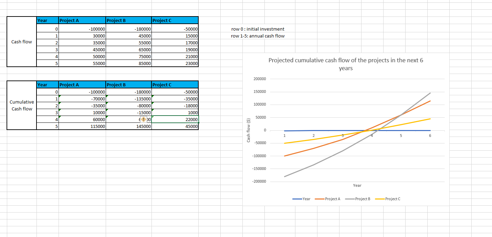

# Excel Financial Modeling – Investment Projects

## Description
This Excel project is a capital budgeting model comparing three investment projects using **NPV, IRR, and Payback Period**.  
It includes a **Cash Flow Table** and automated calculations to support investment decision-making.

## Project File
You can download or view the Excel model here: [Investment Project Model](Investment_Project_Performance_Analysis.xlsx)

## Screenshots

### Cash Flow Table

### Calculations

## How to Use
1. Open `Investment_Project_Performance_Analysis.xlsx` in Microsoft Excel (2016 or later).  
2. Review the **Cash Flow Table** for project inflows and outflows.  
3. Review the **calculations** for NPV, IRR, and Payback Period for each project.
